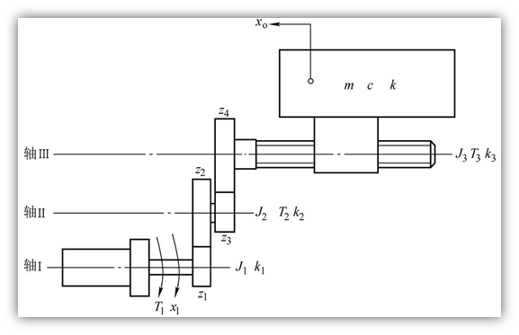
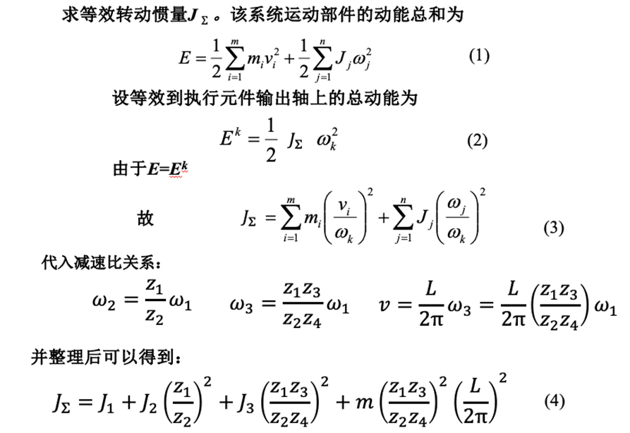
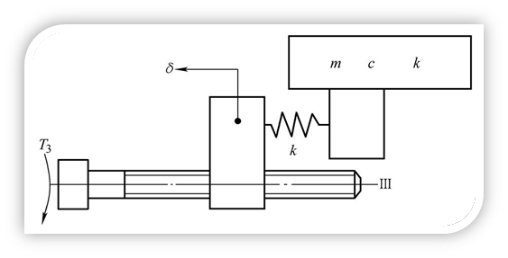

# 机械传动与支承技术

机械系统是机电一体化系统的最基本要素

## 机械移动系统

基本元件是**质量**、**阻尼器**和**弹簧**

基本原理: 牛顿第二定律

$J_1$ 为轴 Ⅰ 部件和电动机转子构成的转动惯量；$J_2$、 $J_3$ 分别为轴 Ⅱ、Ⅲ 部件的转动惯量；$k_1$、$k_2$、$k_3$ 分别为轴 Ⅰ、Ⅱ、Ⅲ 的扭转刚度系数；$k$ 为丝杠螺母副的轴向刚度系数;$m$ 为工作台质量；$c$ 为工作台导轨粘性阻尼系数；$T_1$、$T_2$、$T_3$ 分别为轴的输入转矩

### 转动惯量的折算

$$t = \frac{L}{v} = \frac{2 \pi}{\omega}$$

根据动力平衡关系:丝杠转动一周所做的功等于工作台前进一个导程时其惯性力所做的功，对于工作台和丝杠有

$$T_3' \cdot 2 \pi = m \dot{v} L$$

### 粘性阻尼系数的折算

基本方法是将摩擦阻力、流体阻力及负载阻力折算成与速度有关的粘性阻尼力，再利用摩擦阻力与粘性阻尼力所消耗的功相等这一原则，求出粘性阻尼系数，最后进行相应的当量阻尼系数折算

$$T_3 \cdot 2 \pi = c v L$$

然后用$T_1$和$\omega_1$代换掉, 得到整体的$c$

## 刚度系数的折算

$$
\begin{aligned}
    \theta &= \theta_1 + \theta_2' + \theta_{III}' \\
    &= \theta_{ 1 } + ( \frac { z _ { 2 } } { z _ { 1 } } ) \theta_{ 2 } + ( \frac { z_{ 2 } z_{ 4 } } { z_{ 1 } z_{ 3 } } ) \theta_{ III }
\end{aligned}
$$

> $\theta_2$的作用会呈现在轴 I 上面, 成为$\theta_2'$

---

$$\theta_1 = \frac{T_1}{k_1}$$

$$\theta_{III} = \theta_3 + \Delta \theta_3$$

---

> 用弹簧来理解

$$T_3 \cdot 2 \pi = k \delta L$$

$$\frac{\Delta \theta_3}{2 \pi} = \frac{\delta}{L}$$

> 应变相同, 理解为转一圈, 移动的距离成为正比

可以推到出

$$k_3' = \frac{T_3}{\Delta \theta_3}$$

---

全部用$T_1$表示, 得到$k_\Sigma$, 可以用$k'$来表示
