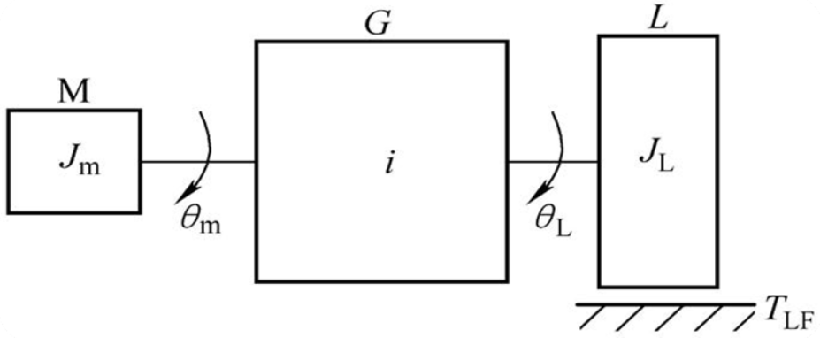
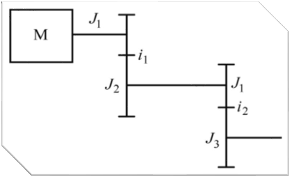

# 复习

## 题型

考试题目类型

- 选择题（每空 2 分，共 30 分）
- 判断题（每空 1 分，共 10 分）
- 填空题（每空 0.5 分，共 10 分）
- 名词解释（每小题 2 分，共 10 分）
- 简答题（每小题 3 分，共 12 分）
- 计算和证明题（每小题 4 分，共 16 分）
- 综合题（每题 6 分，共 12 分）

## 内容

重点了解力是怎么折算的, 速度是怎么折算的, 力矩是如何折算的

> 输出角加速度最大

$$T_{ a } = T_{ m } - \frac { T_{ L F } } { i } = ( J_{ m } + \frac { J_{ L } } { i ^ { 2 } } ) \ddot{\theta_{ m }} = ( J_{ m } + \frac { I_{ L } } { i ^ { 2 } } ) i \ddot{\theta_{ L }}$$

$\frac { T_{ L F } } { i }$是折算在 m 上的

把握

$$i_1 i_2 = i$$

---

$$m = \sum_{ i = 1 } ^ { 4 } m_{ i } = \rho b \sum_{ i = 1 } ^ { 4 } ( D_{ i } / 2 ) ^ { 2 }$$

$$i_{ 1 } = \frac { D_{ 2 } } { D_{ 1 } } , \quad i_{ 2 } = \frac { D_{ 4 } } { D_{ 3 } }$$

---

Strain wave gearing. (2022, November 8). In Wikipedia. https://en.wikipedia.org/wiki/Strain_wave_gearing

structure:

1. input shaft 输入轴
2. wave generator 波发生器
3. flexspline 柔轮
4. circular spline 刚性齿轮
5. output shaft 输出轴
6. housing

当高速轴带动波发生器凸轮和柔性轴承逆时针连续转动时，柔轮上原来与刚轮啮合的齿对开始啮出后脱开，再转入啮入，然后重新啮合，这样柔轮就相对于刚轮沿着与波发生器相反的方向低速旋转，通过低速轴输出运动。若将柔轮 2 固定，由刚轮 5 输出运动，其工作原理完全相同，只是刚轮的转向将与波发生器的转向相同。

---

位移测量传感器是**直线位移**和**角位移测量**的总称。常用的直线位移测量传感器有:**电感传感器**、**差动传感器**、**电容传感器**、**感应同步器**、**光栅传感器**等;常用角位移测量传感器有:**电容传感器**、**光电编码盘**等

---

Moiré pattern. (2023, February 16). In Wikipedia. https://en.wikipedia.org/wiki/Moir%C3%A9_pattern

---

光电编码器的计算

一圈多少脉冲

---

异步电机

转动最小的角度, 达到平衡

---

一台反应式步进电机，通过一对减速齿轮，滚珠丝杠带动工作台，步进电机转子有 24 个齿，采用 3 相 6 拍通电，并设步进电机每走一步工作台移动 7.5 μm。当丝杠导程 $P_h=4 mm$，齿轮 1 的齿数 $z_1=27$ 时，试求齿轮 2 的齿数 $z_2$.

$$\alpha = \frac{360^\circ}{mkz}=\frac{360^\circ}{3 \times 2 \times 24} = 2.5^\circ$$

$$i = \frac{Z_2}{Z_1} = \frac{\alpha P_h}{360^\circ \delta} = \frac{2.5^\circ \times 4}{360^\circ \times 0.0075} = \frac{100}{27}$$
