# 复习重点内容

1. 机电一体化的理论基础

   系统工程、控制论和信息论。

2. 机电一体化系统的基本要素和相关技术。`(*****)`

   基本要素：机械本体、动力部分、传感检测部分、执行部分、驱动部分、控制及信息处理部分、各要素和环节之间相联系的接口

   相关技术：机械技术、传感检测技术、信息处理技术、自动控制技术、伺服传动技术和系统总体技术

3. 现代机械的机电一体化目标。

   现代机械的机电一体化目标是综合利用机、电、信息、控制等各种相关技术的优势，扬长避短，以达到系统优化效果，取得显著的社会效益和技术经济效益。

   具体有：提高精度；增强功能；提高生产效率，降低成本；节约能源，降低能耗；提高安全性、可靠性；改善操作性和实用性；减轻劳动强度，改善劳动条件；简化结构，减轻重量；降低价格；增强柔性应用功能。

4. 数控机床进给系统中基本物理量的折算(转动惯量、粘性阻尼系数、刚度系数)。`(*****)`

   P14~17

   对转动惯量：  
   $$J_\Sigma = J_1 + J_2(\frac{\omega_2}{\omega_1})^2 + J_3(\frac{\omega_3}{\omega_1})^2 + m(\frac{\omega_3}{\omega_1})^2(\frac{L}{2\pi})^2$$

   对粘性阻尼系数：  
   $$c' = (\frac{z_1z_3}{z_2z_4})^2(\frac{L}{2\pi})^2c$$

   刚度系数：  
   $$k_{\Sigma}=\frac{1}{\frac{1}{k_1}+(\frac{z_2}{z_1})^2\frac{1}{k_2} + (\frac{z_2z_4}{z_1z_3})^2(\frac{1}{k_3}+\frac{1}{k'})}$$

5. 机械系统的摩擦(粘性摩擦力、库仑摩擦力、静摩擦力)的特点。`(*****)`

   粘性摩擦力大小与两物体相对运动的速度成正比，如图 2-19a 所示。库仑摩擦力是接触面对运动物体的阻力，大小为一常数，如图 2-19b 所示；静摩擦力是有相对运动趋势但仍处于静止状态时摩擦面间的摩擦力，其最大值发生在相对运动开始前的一瞬间，运动开始后静摩擦力即消失。

   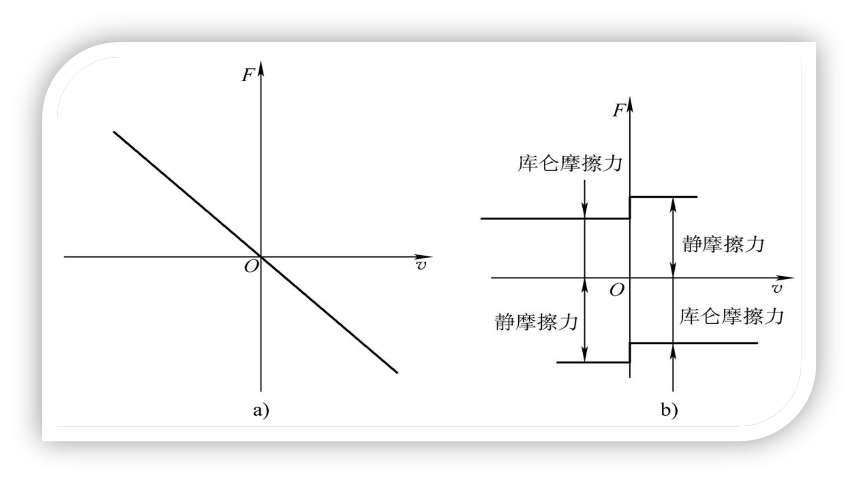

6. 齿轮消隙机构的方法、丝杠螺母调隙机构的方法。`(*****)`

   齿轮消隙机构：

   - 刚性消隙法(手动调整，提高传动刚度)
     - 偏心轴套式消隙机构
     - 锥度齿轮式消隙机构
     - 斜齿圆柱齿轮消隙机构
   - 柔性消隙法(间隙可自动补偿)
     - 双齿轮错齿式弹簧消隙机构
     - 碟形弹簧消除斜齿圆柱齿轮侧隙机构
     - 压力弹簧消隙机构
     - 双斜齿轮消隙机构

   丝杠螺母调隙机构：

   - 垫片式调隙机构(刚性好，调整费时)
   - 螺纹式调隙机构(调整方便，调隙不精确)
   - 齿差式调隙机构(精度较高)

7. 齿轮传动总传动比及各级传动比分配的选择原则(小功率传动装置的最小等效转动惯量和质量最小原则下各级传动比分配原则的证明)。`(*****)`

   - 负载角加速度最大原则
     $$i=\frac{T_{LF}}{T_m}+\sqrt{(\frac{T_{LF}}{T_m})^2+\frac{J_L}{J_m}}$$
     若不计摩擦力则
     $$i=\sqrt{J_L/J_m}$$

   - 最小等效转动惯量原则
     $$i_2 \approx i_1^2 / \sqrt{2}$$
     或
     $$i_1 = (\sqrt{2} i)^{1/3}$$

   > 圆柱体的转动惯量为 $J=md^2/8$

   - 质量最小原则
     $$i_1 = i_2$$

   > 推导证明简要概括为：用传动比表达转动惯量或质量，之后对传动比求导，令其为零可得传动比之间的关系。

   > 关于大功率齿轮传动，最小等效转动惯量原则下符合前小后大，最小质量原则下符合前大后小。

8. 谐波齿轮的核心部件，原理及特点。`(*****)`

   核心部件：

   - 波发生器
   - 柔轮
   - 刚轮

   原理：  
   谐波齿轮减速器的工作原理如图 2-35 所示。若将刚轮 5 固定，外装柔性轴承 4 的波发生器凸轮 3 装入柔轮 2 中，使原形为圆环形的柔轮产生**弹性变形**，柔轮两端的齿与刚轮的齿完全啮合，而柔轮短轴两端的齿与刚轮的齿完全脱开，长轴与短轴间的齿侧逐渐啮入和啮出。当高速轴带动波发生器凸轮和柔性轴承逆时针连续转动时，柔轮上原来与刚轮啮合的齿对开始啮出后脱开，再转入啮入，然后重新啮合，这样柔轮就相对于刚轮沿着与波发生器**相反的方向**低速旋转，通过低速轴输出运动。若将柔轮 2 固定，由刚轮 5 输出运动，其工作原理完全相同，只是刚轮的转向将与波发生器的转向相同。

   特点：

   - 传动比大
   - 传动精度高
   - 承载能力大
   - 结构简单、重量轻、体积小
   - 齿间间隙小
   - 传动平稳

   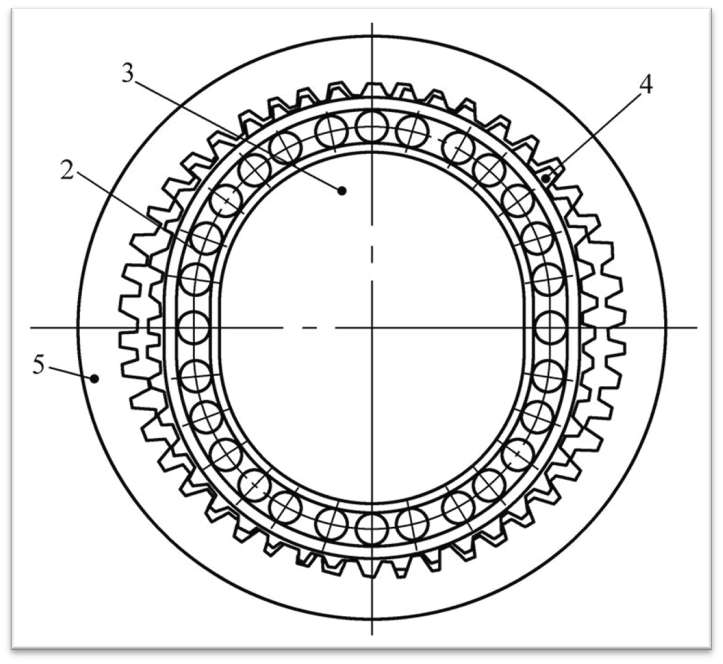

   > 核心部件有： 1—输入轴　 2—柔轮　 3—波发生器凸轮　 4—柔性轴承　 5—刚轮

9. 支承部件的定义。

   支承部件是机电一体化系统中的重要部件，它不仅要**支承、固定和联接**系统中的其他零部件，还要保证这些零部件之间的**相对位置要求和相对运动的精度要求**，而且还是伺服系统的组成部分。机电一体化系统对支承部件的**主要要求是精度高、刚度大、热变形小、抗振性好、可靠性高，并且具有良好的摩擦特性和结构工艺性**。

10. 传感器静态特性(线性度、灵敏度、迟滞和重复性)和动态特性。

    静态特性：

    - 线性度：传感器的实际特性曲线与拟合直线之间的偏差
    - 灵敏度：传感器在静态信号输入情况下，输出变化对输入变化的比值 s(一般希望灵敏度高且恒定)
      $$s=\frac{输入变化量}{输出变化量}=\frac{dy}{dx}$$
    - 迟滞性：迟滞性表明传感器在正(输入量增大)、反(输入量减少)行程期间输入—输出特性曲线不重合的程度，如图 3-4 所示。产生迟滞性现象的主要原因是机械的间隙、摩擦或磁滞等因素。
      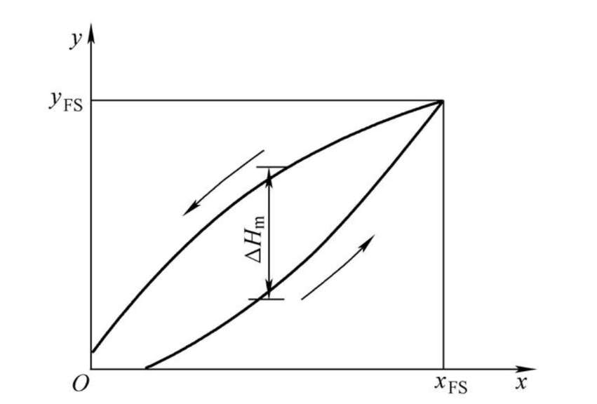
    - 重复性：重复性表示传感器在输入量按同一方向作全程多次测试时所得特性曲线的不一致程度，如图 3-5 所示。

    动态特性：传感器的动态特性是指传感器对输入信号响应的特性，一个动态特性好的传感器其输出能再现输入变化规律(变化曲线)，但实际上除了具有理想的比例特性的环节外，输出信号不可能与输入信号具有完全相同的时间函数，这种输出与输入之间的差异叫做动态误差。

11. 光栅(莫尔条纹原理及计算)、光电编码器、直流测速机的原理；感应同步器(鉴相式和鉴幅式)原理的证明。`(*****)`

    - 光栅  
      把指示光栅平行地放在标尺光栅上面，并且使它们的刻线相互倾斜一个很小的角度，这时在指示光栅上就出现几条较粗的明暗条纹，称为莫尔条纹。它们是沿着与光栅条纹几乎成垂直的方向排列。

      $$W = \frac{P}{\sin \theta}\approx \frac{P}{\theta}$$

      !> 注意用近似的时候$\theta$是弧度

    - 感应同步器：P52~53  
      感应同步器是一种应用电磁感应原理(电压耦合)制造的高精度检测元件，有直线式和圆盘式两种，分别用作检测直线位移和转角。

      $$\frac{L}{W}=\frac{\theta}{360^\circ}$$

      相角:$\theta$  
      定尺的绕组节距:$W$  
      滑尺的相对位移:$L$

    - 光电式转速传感器  
      光电式转速传感器是由装在被测轴(或与被测轴相联接的输入轴)上的带缝隙圆盘、光源、光电器件和指示缝隙盘组成。光源发出的光通过缝隙圆盘和指示缝隙照射到光电器件上。当缝隙圆盘随被测轴转动时，由于圆盘上的缝隙间距与指示缝隙的间距相同，因此圆盘每转一周，光电器件输出与圆盘缝隙数相等的电脉冲，根据测量时间 t 内的脉冲数 N，则可测出转速。

      $$n=\frac{60N}{Zt}$$

      $Z$: 圆盘上的缝隙数  
      $N$: 脉冲个数  
      $t$: 测量时间

      一般取 Z=60×10m(m=0，1，2，…)，利用两组缝隙间距 W 相同，位置相差(i/2+1/4)W(i 为正整数)可辨别出圆盘的旋转方向。

    - 直流测速机  
      恒定磁通由定子产生，当转子在磁场中旋转时，电枢绕组中即产生交变的电势，经换向器和电刷转换成与转子速度成正比的直流电势。当负载电阻 RL➝∞ 时，其输出电压 Uo 与转速 n 成正比。随着负载电阻 RL 变小，其输出电压下降。直流测速机的特点是输出斜率大、线性好。

    - 相对式光电编码器  
      相对式光电编码器是由光栅盘和光电检测装置组成。光栅盘是在一定直径的圆板上等分地开通若干个长方形孔。由于光电码盘与电动机同轴，电动机旋转时，光栅盘与电动机同速旋转，经发光二极管等电子元件将被测轴的角位移转换成二进制编码和脉冲信号。

    - 绝对式光电编码器  
      绝对式测量对于被测量的任意一点位置均由固定的零点作基准，每一被测点都有一个相应的测量值。输出 n 位二进制编码，每一个编码对应唯一的角度。

12. 测量放大器的电路及原理。`(*****)`

    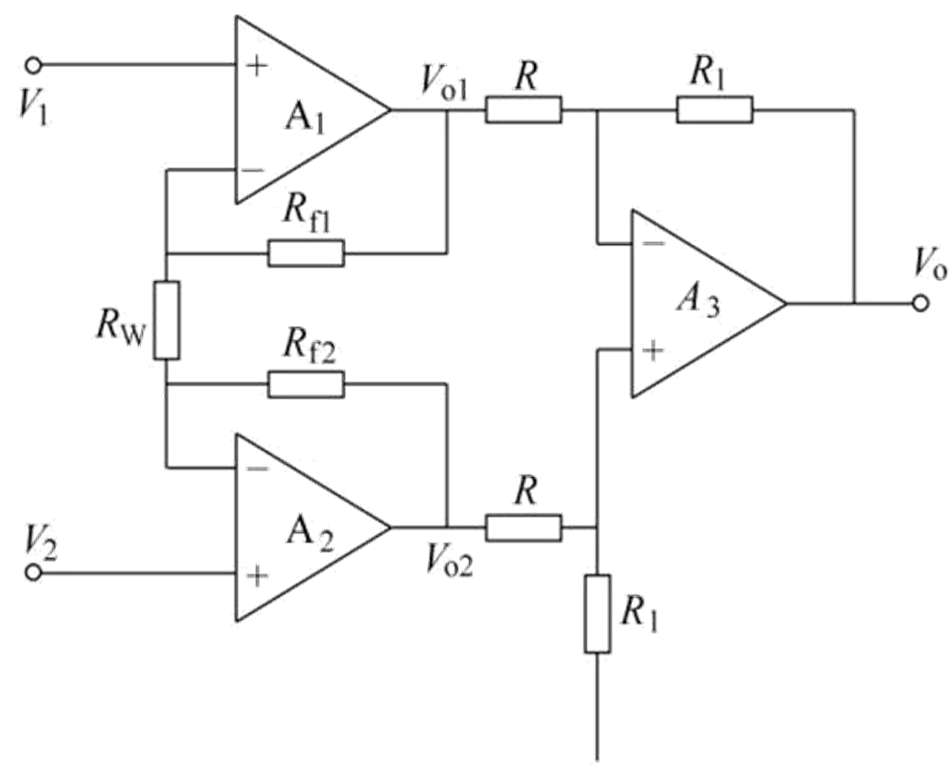

    $$A_V = \frac{V_0}{V_2 - V_1}$$

    $$A_V = \frac{R_1}{R}(1+\frac{R_{f1}+R_{f2}}{R_W})$$

    !> $V_2 - V_1$

    这种电路只要运算放大器 A1 和 A2 性能对称(主要是输入阻抗和电压增益对称)，其漂移将大大减小，具有**高输入阻抗高共模抑制比**，**对微小的差模电压很敏感**，并适用于测量远距离传输过来的信号，因而十分适宜于与微小信号输出的传感器配合使用， RW 是用来调整放大倍数的外接电阻，最好用多圈电位器。

13. 传感器非线性补偿软件处理方法(计算法、查表法和插值法)的原理。

    - 计算法  
      当输出电信号与传感器的参数之间有确定的数字表达式时，就可采用计算法进行非线性补偿。即在软件中编制一段完成数字表达式计算的程序，被测参数经过采样、滤波和标度变换后直接进入计算机程序进行计算，计算后的数值即为经过线性化处理的输出参数。
    - 查表法  
      所谓查表法，就是把事先计算或测得的数据按一定顺序编制成表格，查表程序的任务就是根据被测参数的值或者中间结果，查出最终所需要的结果。
    - 插值法  
      把曲线按一定要求分成若干段，然后把相邻两分段点用线段连起来，用此直线代替相应的各段曲线，即可求出输入 x 所对应的输出值 y。

14. 数字滤波(算术平均值法、中值滤波法、防脉冲干扰平均值法、程序判断滤波法)。

    - 算术平均值法(N 越大，平滑度越高、灵敏度越低)
      $$Y = \frac{1}{N} \sum^N_{i=1}X_i$$
    - 中值滤波法(适用于缓慢变化的过程)  
      中值滤波法是在三个采样周期内，连续采样读入三个检测信号 X1、X2、X3，从中选择一个居中的数据作为有效信号，以算式表示为若 X1<X2<X3，则为 X2 有效信号。

    - 防脉冲干扰平均值法  
      上述两种方法的结合，先排序 $X_1 < X_2 < ... < X_N$ ，再排除最大值和最小值后计算算术平均值 $Y = (X_2 + X_3 + ... + X_{N-1}) / (N-2)$

    - 程序判断滤波法(限幅滤波法)  
      若|Xk-Xk-1|<ΔX0，则以本次采样值 Xk 为真实信号;  
      若|Xk-Xk-1|>ΔX0，则以上次采样值 Xk-1 为真实信号。  
      其中，ΔX0 表示误差上、下限的允许值，ΔX0 的选择取决于采样周期 T 及信号 X 的动态响应。  
      或  
      设采样时刻 t1、t2、t3 的采样值为 X1、X2、X3。  
      若|X2-X1|<ΔX0，则取 X2 为真实信号。  
      若|X2-X1|≥ΔX0，则先保留 X2，再与 X3 进行比较，若|X3-X2|<ΔX0，则取 X2 为真实信号;  
      若|X3-X2| ≥ ΔX0，则取(X2+X3)/2 为真实信号。  
      实用中，常取 ΔX0=(|X1-X2|+|X2-X3|)/2 限速滤波法较为折中，既照顾了采样的实时性，也照顾了采样值变化的连续性。

15. 伺服的含义，伺服控制系统(控制器+功率放大器+执行机构+检测装置)。

    伺服(Servo)的意思即“伺候服侍”，就是在控制指令的指挥下，控制驱动元件，使机械系统的运动部件按照指令要求进行运动。

    - 控制器：控制器的主要任务是根据**输入信号和反馈信号**决定控制策略。常用的控制算法有 PID(比例、积分、微分)控制和最优控制等。控制器通常由电子线路或计算机组成。
    - 功率放大器：伺服系统中的功率放大器的作用是**将信号进行放大**，并用来**驱动执行机构**完成某种操作。在现代机电一体化系统中的功率放大装置，主要采用各种电力电子器件组成。
    - 执行机构：执行机构主要由**伺服电动机**或**液压伺服机构**和**机械传动装置**等组成。目前，采用电动机作为驱动元件的执行机构占据较大的比例。伺服电动机包括步进电动机、直流伺服电动机、交流伺服电动机等。
    - 检测装置：检测装置的任务是**测量被控制量(即输出量)**，实现**反馈控制**。伺服传动系统中，用来检测位置量的检测装置有：自整角机、旋转变压器、光电码盘等，用来检测速度信号的检测装置有：测速发电机、光电码盘等。

16. 直流电机、交流电机、步进电机的原理及种类。`(*****)`

    直流电机：  
    直流伺服电动机分为

    - 永磁直流伺服电动机
    - 无槽电枢直流伺服电动机
    - 空心杯电枢直流伺服电动机
    - 印制绕组直流伺服电动机

    交流伺服电动机

    > 交流伺服电动机由于克服了直流伺服电动机存在的**电刷**和**机械换向器**而带来的各种限制

    - 同步型交流伺服(永磁同步)电动机：同步伺服电动机主要由**转子和定子**两大部分组成。在转子上装有特殊形状高性能的**永磁体**，用以产生恒定磁场，无需励磁绕组和励磁电流。在电动机的定子铁心上绕有**三相电枢绕组**，接在可控的变频电源上。为了使电动机产生稳定的转矩，电枢电流磁动势必须与磁极同步旋转，因此在结构上还必须装有转子永磁铁的**磁极位置检测器**，随时检测出磁极的位置，并以此为依据使电枢电流实现**正交控制**。这就是说，同步伺服电动机实际上包括定子绕组、转子磁极及磁极位置传感器三大部分。
    - 异步型交流伺服(异步感应) 电动机：两相异步感应交流伺服电动机，其结构分为两大部分，即**定子部分和转子部分**。在定子铁心中安放着空间成**90° 电角度**的**两相定子绕组**，其中一相为**励磁绕组**，始终通以**交流电压**，另一相为**控制绕组**，输入同频率的控制电压，改变控制电压的幅值或相位可实现调速。转子的结构通常为**笼形**。两相异步交流伺服电动机主要用于小功率控制系统中。

    步进电机：

    - 反应式步进电动机，反应式步进电动机亦称磁阻式(VR)步进电动机，其基本结构主要由**定子和转子**两部分组成。其定子和转子磁路均由**软磁**制成，定子有若干对磁极，磁极上有**多相励磁绕组**，在转子的圆柱面上有**均匀分布的小齿**。**利用磁阻的变化产生转矩**。励磁绕组的相数一般为三、四、五、六相等。
    - 永磁式步进电动机，永磁式步进电动机是转子或定子的某一方为**永磁体**，另一方由**软磁材料和励磁绕组**制成，绕组轮流通电，**建立的磁场与永磁体的恒定磁场相互作用**，产生转矩。励磁绕组一般做成两相或四相控制绕组。
    - 永磁感应式步进电动机，这种电动机在**转子上有永磁体**，可以看作是永磁式步进电动机；但从定子的导磁体来看，又和反应式步进电动机相似，因而它既具有反应式步进电动机步距角小、响应频率高的优点，又具有永磁式步进电动机励磁功率小、效率高的优点。它是**反应式和永磁式步进电动机的结合**，因此又称为混合式步进电动机。

17. 电气控制系统的功率放大器(变流器)种类(整流器、逆变器、变压器或变频器、斩波器)。

    - 整流器：AC/DC
    - 逆变器：DC/AC
    - 变压器或变频器：AC/AC
    - 斩波器：DC/DC

18. 开环步进电机控制系统(**环形分配器、功率驱动器、步进电机及负载**)，步进电机环形分配的方法(**计算机软件分配、小规模集成电路搭接硬件分配器、专用环形分配器**)。

    环形分配器：

    - 计算机软件分配
    - 小规模集成电路搭建硬件分配器
    - 专用环形分配器

    - 功率驱动器实际上是一个功率开关电路，其功能是将环形分配器的输出信号进行**功率放大**，得到步进电动机控制绕组所需要的**脉冲电流**(对于伺服步进电动机，励磁电流为几安培，而功率步进电动机的励磁电流可达十几安培)及所需要的**脉冲波形**。

19. 步进电机+减速器+丝杠螺母+光电编码器+工作台的计算。`(*****)`

    看 PPT 例题(第 4 章)

20. 旋转变压器、相敏放大器原理。

    - 旋转变压器：旋转变压器是一种**输出电压随转角变化的角位移测量装置**。它的结构通常做成**两极电机**的形式，其定子、转子均由硅钢片迭压而成，定子和转子上各有两套在空间上完全**正交**的绕组。旋转变压器的工作原理与普通变压器相似，区别在于普通变压器的原边、副边绕组是相对固定的，所以输出电压和输入电压之比是常数，而旋转变压器的**原边、副边绕组则随转子的角位移发生相对位置的改变**，因而其输出电压的大小随转子角位移而发生变化，输出绕组的电压幅值与转子转角成正弦、余弦函数关系，或保持某一比例关系，或在一定转角范围内与转角成线性关系。

    $$
    \begin{aligned}
    &u_{W1} = U_m \sin\omega t \\
    &u_{W2} = U_m \cos\omega t \\
    &u_{R1} = m(u_{W1}\sin\theta + u_{W2} \cos\theta) \\
    &u_{R2} = m(u_{W1}\cos\theta - u_{W2} \sin\theta) \\
    \end{aligned}
    $$

    > 这里有疑惑，为什么是减

    - 相敏放大器，相敏放大器也称为鉴幅器。它的功能是将交流电压转换为与之成正比的直流电压，并使它的极性与输入的交流电压的相位相适应。
    - 相敏放大器的任务是：
      - 将输入交流电压变换成直流电压；
      - 当输入交流电压相位变成相差 π 时，输出的直流电压极性亦随之改变。或者说输出直流电压的极性反映了输入交流电压的相位；
      - 输出直流电压的数值与输入交流电压的幅值成正比。

21. 常用的电力电子元器件(晶闸管、功率晶体管……)。

    - 晶闸管
    - 功率晶体管
    - 绝缘栅双极型晶体管

22. 脉宽调制型(PWM)功率放大器基本原理。

    利用大功率器件的开关作用，将直流电压转换成一定频率的方波电压，通过对方波脉冲宽度的控制，改变输出电压的平均值。

23. 双极式 H 型可逆 PWM 变换器的原理。`(*****)`

    在一个开关周期内，当 0≤t≤ton 时，Ub1 和 Ub4 为正，晶体管 VT1 和 VT4 饱和导通，而 Ub2 和 Ub3 为负，VT2 和 VT3 截止。这时(+Us)加在电枢 A、B 两端，UAB=Us，电枢电流 id 沿回路 1 流通。当 ton≤t≤T 时，Ub1 和 Ub4 变负，VT1 和 VT4 截止；Ub2 和 Ub3 变正，但**VT2 和 VT3 并不能立即导通**，因为电枢电感释放储能形成的电流 id 沿回路 2 经 VD2、VD3**续流**。VD2、VD3 两端的压降，正好使 VT2 和 VT3 的 C-E 极承受反压，这时 UAB=-Us。在一个周期内，UAB 正负相间，这就是双极 PWM 变换器的特征。其电压电流波形见图 4-17 所示。

    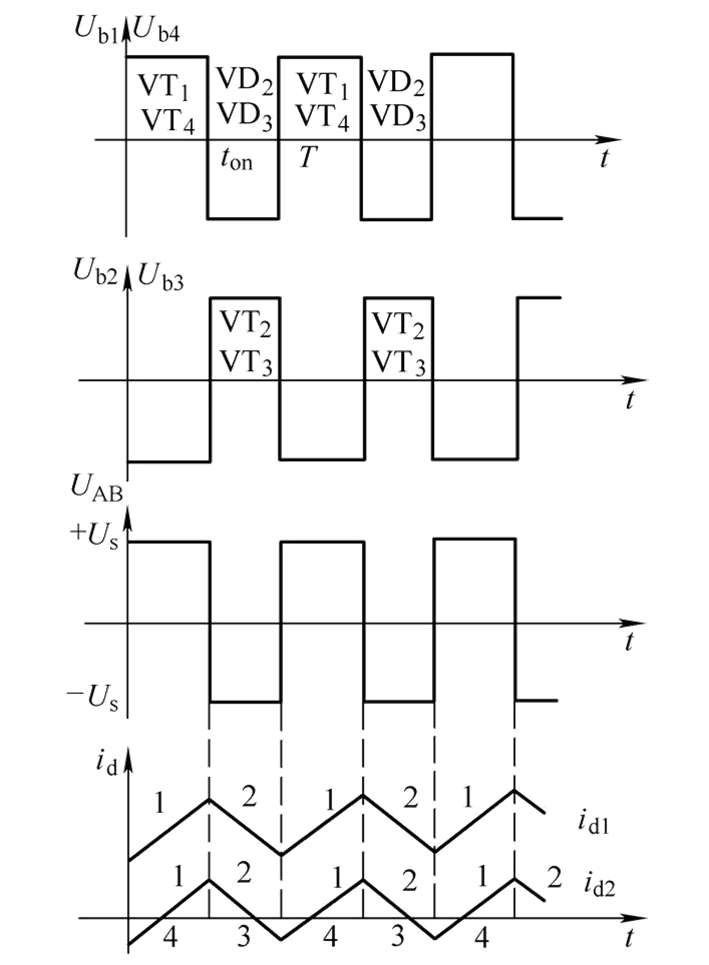

    由于电压 UAB 的正负变化，使电动机电流的波形根据负载轻重的不同分为两种情况：图 4-17 中的 id1 表示电动机负载较重的情况，这时平均负载电流大，在续流阶段(ton≤t≤T)，电流仍维持正方向，电动机始终工作在第一象限的电动状态(即正向电动状态)。id2 表示电动机在轻载的情况，平均电流小，在续流阶段，电流很快衰减到零。于是 VT2、VT3 的 C-E 极反压消失，在负的电源电压(-Us)和电枢反电动势的合成作用下，VT2、VT3 导通，电枢电流反向，沿回路 3 流通，电动机处于制动状态。同样可以分析，在 0≤t≤ton 期间，负载轻时，电流也有一次倒向。

    双极 PWM 变换器的特征就是在一个周期内，电压从(+Us)变为(-Us)。那么如何来控制电动机的正转和反转呢?这只要控制正、负脉冲的宽窄。当正脉冲较宽时，ton>2/T，则电枢两端的平均电压为正，电动机正转(见图 4-17 的波形)。当正脉冲较窄时，ton<2/T，平均电压为负，电动机反转。如果正负脉冲宽度相等， ton=2/T，平均电压为零，则电动机不转。

    根据图 4-17 很容易导出双极式可逆 PWM 变换器电枢平均两端电压的表达式，调速时，ρ 值的变化范围变成-1≤ρ≤1。当 ρ 为正时，电动机正转；ρ 为负值时，电动机反转；ρ=0 时，电动机停止。

    $$U_d = \frac{t_{on}}{T} U_s - \frac{T-t_{on}}{T} U_s = (\frac{2t_{on}}{T}-1)U_s$$
    $$\rho=\frac{2t_{on}}{T}-1$$

    调速时，ρ 值的变化范围变成-1≤ρ≤1。当 ρ 为正时，电动机正转；ρ 为负值时，电动机反转；ρ=0 时，电动机停止。

    需要注意的是：ρ=0 时电动机的停止与 4 个晶体管都不导通时的电动机的停止是有区别的。4 个晶体管均不导通时电动机是真正的停止；而 ρ=0 时，虽然电动机不动，但电枢两端的瞬时电压和瞬时电流都不是零，而是交变的，这个电流的平均值为零，产生的平均力矩也为零，但电动机带有**高频微振**，能克服静摩擦阻力，消除正、反向时的静摩擦死区。

24. 锯齿波脉宽调制器电路原理。`(*****)`

    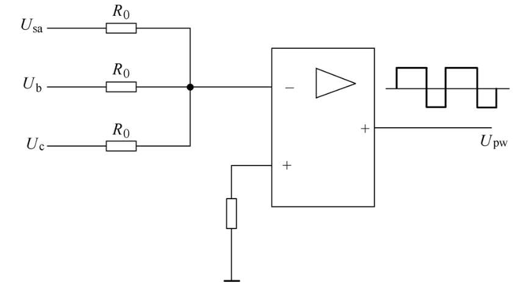

    加在运算放大器反相输入端的三个输入信号，一个输入信号是锯齿波调制信号，由锯齿波发生器提供，其频率是主电路所需的开关调制频率。另一个是控制电压 Uc，其极性和大小可变。对于不同控制方式的 PWM 变换器，对调制脉冲电压 Upw 的要求是不一样的。

    对于双极式可逆变换器，要求当输出平均电压 Ud=0 时，Upw 的正负脉宽度相等，这就要求控制电压 Uc 也恰好为零。为此，在运算放大器的输入端引入第三个输入信号——负偏移 Ub，其值为负的 Usamax 的一半。

    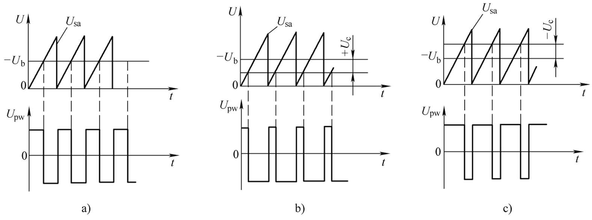

    - 当 Uc = 0，输出的 PWM 正负各占一半，平均电压为 0；
    - 当 Uc > 0，正半波的宽度减小；
    - 当 Uc < 0，正半波的宽度增大。

25. 直流伺服电机微分方程推导。`(*****)`

    $$
    \begin{aligned}
    &T = k_m i_d  \\
    &E_e = k_e \omega \\
    &U_d = E_e + R_a i_d + L_a \frac{\mathrm{d}i_d}{\mathrm{d}t} \\
    &T - T_L = J \frac{\mathrm{d}\omega}{\mathrm{d}t} \\
    &U_d = E_e + R_a \frac{T}{k_m} + L_a \frac{\mathrm{d}T}{k_m\mathrm{d}t} \\
    &U_d = E_e + R_a \frac{T_L + J \frac{\mathrm{d}\omega}{\mathrm{d}t}}{k_m} + \frac{L_a}{k_m} \frac{\mathrm{d}(T_L + J \frac{\mathrm{d}\omega}{\mathrm{d}t})}{\mathrm{d}t} \\
    &U_d = k_e \omega +  \frac{R_a T_L}{k_m} + \frac{R_a J}{k_m} \frac{\mathrm{d} \omega}{\mathrm{d}t} + \frac{L_a}{k_m}\frac{\mathrm{d}T_L }{\mathrm{d}t} + \frac{J L_a}{k_m} \frac{\mathrm{d}^2\omega}{\mathrm{d}t^2} \\
    &\frac{L_a J}{k_e k_m} \frac{\mathrm{d}^2\omega}{\mathrm{d}t^2} + \frac{R_a J}{k_e k_m} \frac{\mathrm{d} \omega}{\mathrm{d}t} + \omega = \frac{1}{k_e} U_d - \frac{L_a}{k_e k_m}\frac{\mathrm{d}T_L }{\mathrm{d}t} - \frac{R_a}{k_e k_m}T_L\\
    \end{aligned}
    $$

26. 交流异步电机转速方程，变频调速原理及特性(基频以下恒磁通(恒转矩)调速、基频以上恒功率调速)。`(*****)`

    - 转速方程：

      $$n=\frac{60f_1}{p}(1-s) = n_1(1-s) $$

      $n$: 电动机转速  
      $n_1$: 定子转速磁场的同步转速  
      $f_1$: 定子供电频率  
      $s$: 转差率  
      $p$: 极对数

      由上式可知，通过调节频率 $f$ 可以调节转速。

    > 由下式可以发现两种调速方式：
    >
    > $$E = 4.44f_1N_1\Phi$$

    - 恒磁通调速：保持 $E/f$ 为常数
    - 恒功率调速：由于 $E$ 已升高至额定电压而不能再提高，所以磁通 $\Phi$ 不可避免地降低

27. 正弦波脉宽调制(SPWM)同步调制、异步调制和分段同步调制。`(*****)`

    脉宽调制技术中，以所**期望的波形作为调制波**，而**受它调制的信号称为载波**。在 SPWM 中常用**等腰三角波作为载波**，因为等腰三角波是上下宽度线性对称变化的波形，它与光滑的正弦曲线相比较，得到一组**等幅而脉冲宽度随时间按正弦规律变化的矩形脉冲**。用三相正弦信号调制，便获得三相 SPWM 波形。图 4-33 绘出了三相 SPWM 逆变器工作在双极式控制方式的输出电压波形。

    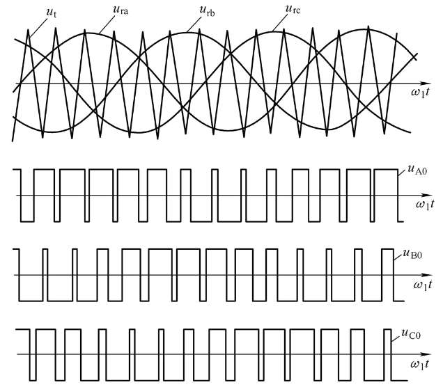

    定义载频比：
    $$N = \frac{f_c}{f}$$

    > $f_c$ 为三角载波的频率，$f$ 为正弦调制波的频率。

    - 同步调制：保持 $N$ 不变的调制
      - 可保证输出波形的对称性
      - 为保证三相对称，应使 $N$ 是 3 的倍数
      - 为保证双极调制时正负半波对称，应使 $N$ 为奇数
    - 异步调制：保持 $f_c$ 不变，使 $N$ 变化
    - 分段同步调制：如下图所示，恒转矩区的低速段采用异步调制，高速段采用分段同步调制，$N$ 逐级改变。恒功率区取 $N=1$ 。

    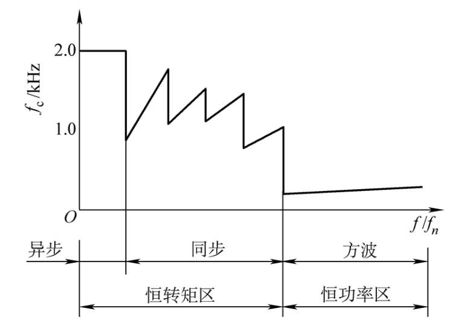

28. 模数转换量化误差，模数转换和数模转换原理及其接口组成。`(*****)`

    - 量化误差  
      由离散模拟信号(时间离散，值连续)转换为数字信号的过程称为量化过程。在量化过程中，由于二进制数可表达的幅值有限所以会产生量化误差。量化误差的大小取决于量化单位 $q$ 。

    设量程为 M ，二进制数的位数为 N ，那么量化单位为
    $$q = M / 2^N$$
    量化误差为  
    $$e = \pm q/2$$

    - 数模转换：主要由权电阻网络、参考电压、电子开关组成。因为并联分流，经过 2R 的电流依次减半。控制电子开关 S 即可控制通过 $R_f$ 的电流，从而控制输出电压。

      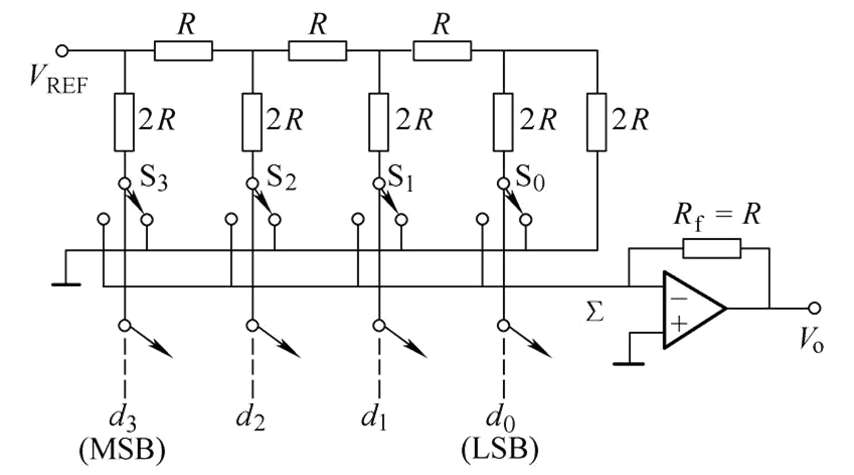

    - 模数转换：常用方法有逐次逼近法、双积分法。逐次逼近法的原理如下图所示。由寄存器、转换器和控制逻辑部分组成。转换时先将寄存器最高位置 1，通过 D/A 转换为模拟信号与输入信号比较，若输入信号更大，则保留 1，若更小则清 0。然后将寄存器下一位置 1，重复此过程。

      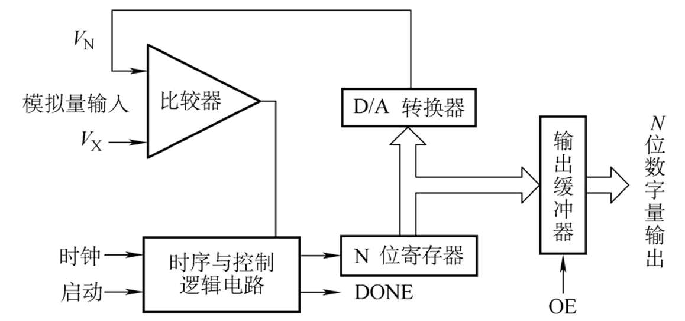

29. 直接数字控制，监督控制系统。

    - 直接数字控制(DDC)：计算机的**运算和处理结果**直接输出作用于**被控对象**
    - 监督控制系统(SCC)：所谓监督控制系统(Supervisory Computer Control)就是根据原始的**生产工艺信息**及**现场检测信息**按照描述生产过程的**数字模型**，计算出生产过程的**最优设置值**。输入给 DDC 系统或连续控制系统。SCC 系统的输出值不直接控制执行机构，而是给出下一级的最佳给定值。因此是较高一级的控制。它的任务是着重于控制规律的修正与实现，如最优控制、自适应控制等，实际上它是操作指导系统与 DDC 系统的综合与发展。

30. 模拟装置的数字化方法(直接差分法、匹配 Z 变换法、双线性变换法)。`(*****)`

    - 直接差分法
      - 向前
        $$s = \frac{z-1}{T}$$
      - 向后
        $$s = \frac{1-z^{-1}}{T}$$
    - 匹配 z 变换法 $$(s-a) = (1-z^{-1}e^{aT})$$
    - 双极性变换法 $$s = \frac{2}{T} \frac{1-z^{-1}}{1+z^{-1}}$$

31. 直接差分法(向前差分法、向后差分法)，D(s)和 D(z)的对应关系(向前差分、向后差分、矩形积分法)。

    - 向前差分 $$u(k) = \frac{e(k+1) - e(k)}{T}$$
    - 向后差分 $$u(k) = \frac{e(k) - e(k-1)}{T}$$

    > 将 $D(s)$ 的 s 用 $(1-z^-1)/T$ 替代可得 $D(z)$

32. 工业机器人的定义、组成、重要特征及三代工业机器人(程序控制、适应性控制和智能控制)。

    定义：

    - ISO 定义：一种**可重复编程**的多功能操作手,用以**搬运**材料、零件、工具或者是一种为了完成不同**操作**任务,可以有多种程序流程的专门系统。
    - 国标定义：一种能自动定位控制、可重复编程的、多功能的、多自由度的操作机。能搬运材料、零件或操作工具,用以完成各种作业。

    特征：

    - 可再编程
    - 是机械装置
    - 有自动控制系统

    三代机器人：

    - 示教(Unimate)
    - 传感器(通用汽车)
    - 自主决策

    组成：

    - 操作机
      - 机座
      - 立柱
      - 手臂
      - 手腕
      - 手部
    - 驱动系统
      - 驱动器
      - 减速器
      - 检测元件
    - 控制系统
      - 从构成看
        - 闭环
        - 开环
      - 控制方式
        - 程序控制系统
        - 适应性控制系统
        - 智能控制系统
    - 人工智能系统
      - 感觉系统：传感器
      - 决策系统
        - 逻辑判断
        - 模式识别
        - 大容量数据库
        - 规划操作程序

33. 按操作机分类(直角坐标型、圆柱坐标型、球坐标型、多关节型和平面关节型)的工业机器人的定义及特点；按控制方式分类(点位控制、连续轨迹控制)。

    按操作机分类：

    - 直角坐标型(PPP)：结构简单、精度最高、控制无耦合；体积大、动作范围小、灵活性差。
    - 圆柱坐标型(RPP)：体积小、工作范围大、精度仅此于直角坐标型；难与其它机器人协调工作。
    - 球坐标型(RRP)：结构紧凑、工作范围大、能协调工作。精度尚可。
    - 多关节型(RRR)：结构最紧凑、灵活性大、占地面积最小、工作空间最大、能协调工作；但精度较低。
    - 平面关节型(PRR)：结构简单、动作灵活、多用于装配作业。(SCARA)

    按控制方式分类：

    - 点位控制：点对点，不对运动轨迹控制。(点焊、搬运)
    - 连续轨迹控制：控制轨迹和运动速度。(弧焊、喷漆、检测)

34. 工业机器人操作机的组成(**机座、立柱、手臂、手腕和手部**)。

    - 手臂：一般应有至少 3 个自由度
    - 手腕：一般应实现 3 个旋转自由度
      - 弯曲式关节(B)：相邻构件的轴线角度有变化
      - 转动式关节(R)：相邻构件的轴线角度无变化
    - 手部
      - 机械夹持器
      - 专用工具

35. 按弯曲式关节(R)和转动式关节(B)分类的七种工业机器人手腕(R-R，B-R，B-B-R，B-R-R，R-B-R，R-B-R，R-R-R，R-B-B)。

    课本 P178 图 7-9

36. 空间工业机器人机构齐次坐标变换矩阵(D-H (Denavit-Harterberg)矩阵)。

    一个 4×4 矩阵

37. 旋转矩阵的组合计算。
    右乘/左乘

38. 工业机器人运动学方程的正解和逆解的定义；静力学分析(力平衡方程和力矩平衡方程)；动力学分析(牛顿-欧拉方程)。`(*****)`

    - 正解：已知运动参数和结构参数，求位姿
    - 逆解：给定工作条件（位姿）和结构参数，求运动参数

    - 力平衡方程：$$F_{i-1,i} - F_{i, i+1} + m_ig = 0$$
    - 力矩平衡方程：$$M_{i-1,i} - M_{i, i+1} + (r_{i-1,i}-r_{i,c_i})\times F_{i-1,i} - r_{r_i,c_i} \times F_{i,i+1} = 0$$
      一般假设机器人手部与环境之间的力 $F_{n, n+1}$ 和力矩 $M_{n,n+1}$ 已知，从而可以通过递推的方式由末端到基座求出各个杆件受到的力与力矩。

    - 牛顿-欧拉方程：
      $$
      \begin{aligned}
      & F_{i-1,i} - F_{i, i+1} + m_i g - m_i \dot v_{ci} = 0 \\
      & M_{i-1,i} - M_{i, i-1} + (r_{i-1,i}-r_{i,c_i})\times F_{i-1,i} - r_{r_i,c_i} \times F_{i,i+1} -I_i \dot \omega_i - \omega_i \times (I_i \omega_i) = 0
      \end{aligned}
      $$

39. 人-信息-物理系统(Human-Cyber-Physical Systems)和数字孪生(Digital Twin)。

    智能制造系统的基本原理

40. 中国制造 2025 的十大重点发展领域。`(*****)`

    - 新一代信息技术产业
    - 高档数控机床和机器人
    - 航空航天装备
    - 海洋工程装备及高技术船舶
    - 先进轨道交通装备
    - 节能与新能源汽车
    - 电力装备
    - 农业装备
    - 新材料
    - 生物医药及高性能医疗器械

> 注：`(*****)`为难点内容
